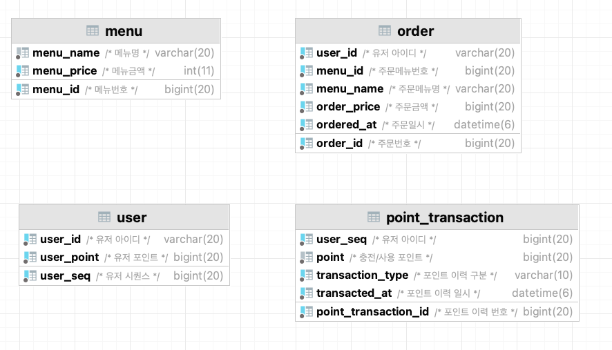

# 커피숍 주문 시스템

## 활용 기술

- Spring Boot 3.0.2
- Java 17
- JPA
- MySQL
- H2 (테스트 코드)

## ERD

## 작업 목록

### 서비스

#### 작업 완료
- DDL( 데이터 타입, 인덱스, 유니크 고려 ) 작성
- 서비스 로직 개발
- API 설계 ( 스웨거를 통한 API 문서 작성 )
- 예외 처리 및 API 응답 일관화

#### 작업 중

#### 작업 예정
- 동시성 이슈 / 데이터 일관성 보장을 고려한 서비스 개발
- 성능 향상을 위한 캐시 적용
- 데이터 수집 플랫폼으로 실시간 주문 데이터 전송

### 테스트

#### 작업 완료
- 레포지토리 테스트
- 단위 테스트
- 통합 테스트
  1. 주문
  2. 동시에 2건 이상의 주문

#### 작업 중

#### 작업 예정

